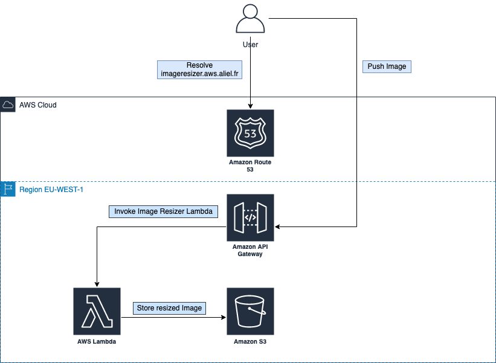

# Image Resizer
This repository deploy the stack for the Aircall SRE challenge

## Create Github Actions User
### With AWS Cli deploy a cloudformation template to create the user.
    aws cloudformation deploy --template-file cloudformation/create_account.yml --stack-name github-user --capabilities CAPABILITY_NAMED_IAM

### Create an access key on AWS Console and add it to your project secret
Access key secret must be named `AWS_ACCESS_KEY_ID`

Secret key secret must be named `AWS_SECRET_ACCESS_KEY`

Create a secret name `AWS_ROLE_TO_ASSUME` with value `github-user-GithubRole`

## Push this code to your GitHub repo
Github Actions automatically deploy the stack when a change occurs on `master` branch.

## Send an image to resize
To resize your image, post it to url : https://imageresizer.aws.aliel.fr/image

Example:

    curl --location --request POST 'https://imageresizer.aws.aliel.fr/image' --form 'file=@img.jpg' --form 's3Key=img.jpg'

The resized image will be available on the destination s3 bucket url : https://rclaveau-imageresizer-uploads.s3.amazonaws.com

Example:

https://rclaveau-imageresizer-uploads.s3.amazonaws.com/img.jpg

